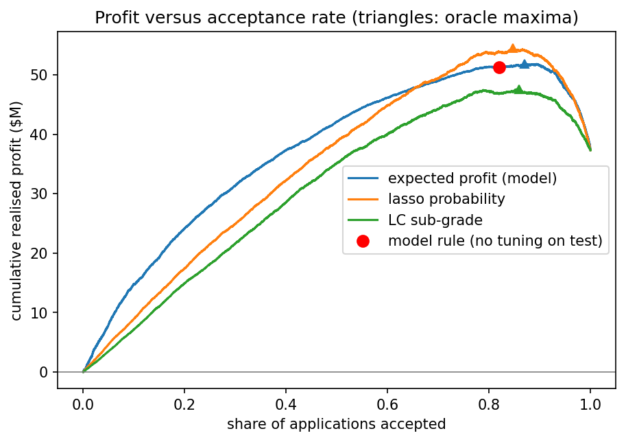
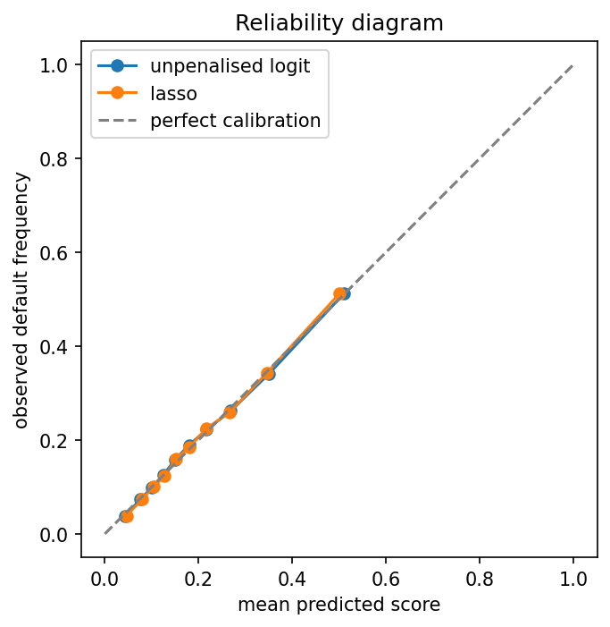

# From score to profit: a decision layer for consumer credit

Most credit-risk projects stop at an AUC. An AUC says neither which loans to grant nor how much the
lender earns. This project goes from Lending Club application data to a **lending policy measured in
dollars**, in three layers kept strictly apart: rank the borrowers, check that the probabilities
mean what they say, then decide from loan-specific costs.

## Results at a glance

On 75,006 held-out loans issued in 2015:

| Policy | Accepted | Default rate | Realised profit | Return on lent |
|---|---|---|---|---|
| Accept every loan (what Lending Club did with these loans) | 100 % | 20.2 % | $37.3 M | 3.4 % |
| **Model rule** (grant if expected profit > 0) | 82 % | 15.7 % | **$51.3 M** | **6.0 %** |
| Lending Club sub-grades, same volume | 82 % | 15.8 % | $46.8 M | 5.4 % |
| Lasso probability alone, same volume | 82 % | 14.9 % | $53.9 M | 6.4 % |

Paired bootstrap, 2,000 resamples of the test set (95 % intervals):

| Comparison | Profit difference | 95 % CI |
|---|---|---|
| Model rule vs accept all | +$14.0 M | [12.2, 15.7] |
| Model rule vs Lending Club grades | +$4.5 M | [2.9, 6.2] |
| Lasso probability vs Lending Club grades | +$7.1 M | [5.6, 8.5] |
| Model rule vs lasso probability | −$2.6 M | [−3.6, −1.6] |

- The scorecard (L1-penalised logistic regression, 82 of 125 columns) reaches **AUC 0.729 and
  AP 0.416** against a base rate of 0.202, and is **calibrated**: calibration error below
  5 × 10⁻⁵ in the Brier decomposition.
- At equal volume, **the score selects better than Lending Club's own grades** (+$7.1 M).
- The ex-ante profit model, estimated on the training set, **matches realised profit on the test
  set within 2 %**, by loan term and by outcome.
- One surprise, explained below: ranking by risk alone beats the dollar-aware rule by $2.6 M.



## The data

The public Lending Club file (Kaggle: `wordsforthewise/lending-club`), 2.2 M loans and 151 columns,
restricted to **completed** (`Fully Paid` / `Charged Off`), **individual** loans **issued in 2015**:
375,144 loans, 20.2 % defaults.

Every column passed a single test: *did this information exist when the lending decision was
made?* Payments, recoveries, refreshed FICO scores, hardship and settlement fields were dropped.
Lending Club's own grade, sub-grade and interest rate were also excluded from the score — and so
was the instalment, which pins down the rate exactly given the amount and the term. The score is
therefore independent of Lending Club's model, and can be compared with it.

## Method

**Notebook 01 — data and scorecard.** Leakage audit, derived variables, stratified 80/20 split,
preprocessing inside a scikit-learn pipeline (median imputation *with missing indicators*: here a
missing value means "no incident on record", which is information). Unpenalised logistic
regression as a reference, then an L1-penalised one tuned by 5-fold cross-validation with the
one-standard-error rule. A regularisation path and a bootstrap stability study show that about 50
variables reach the performance plateau and that about 50 are selected in every resample.

**Notebook 02 — evaluating the score, independently of any decision.** ROC and precision-recall
curves (AP is read against the base rate, never in the absolute), reliability diagram and Murphy
decomposition of the Brier score. The decomposition separates what can be repaired after the fact
(calibration) from what cannot (resolution). A control row divides every score by ten: the ranking
is untouched, and the Brier score becomes *worse than predicting the base rate for everyone*.



**Notebook 03 — the decision.** A loan is granted when its expected profit is positive:

$$(1-p_i)\,G_i - p_i\,L_i > 0 \iff p_i < t_i = \frac{G_i}{G_i + L_i}$$

where $`I_i`$ is the scheduled interest and $`A_i`$ the amount lent:

$$G_i = \kappa_T \, I_i, \qquad L_i = \mathrm{LGD}_T \, A_i$$

$`\kappa_T`$ is the share of scheduled interest actually collected on repaid loans (below 1 because
of early repayment); $`\mathrm{LGD}_T`$ is the share of the amount lent actually lost on defaulted
loans (net of instalments paid before default and of recoveries). Both are estimated per loan term
on the training set. This is the familiar cost threshold $`c_{FP}/(c_{FP}+c_{FN})`$ with
**loan-specific costs**: the amount lent cancels out, so the threshold depends only on price and
term, and rises with the interest rate.

Profit is computed twice, with different information: **ex ante** to decide (only what is known at
application time), **ex post** to evaluate (cash actually received). Mixing the two would be a leak.

## The surprise, and what explains it

Ranking by risk alone earns $2.6 M more than the dollar-aware rule. The reason: κ and the LGD are
averages per loan term, whereas prepayment rises with the interest rate — the share of
scheduled interest actually collected falls from 84 % to 75 % across rate quintiles on 36-month
loans. With average parameters, the rule overvalues expensive loans and accepts too many risky
ones. Estimating the parameters by rate band is the natural extension.

## Limitations

- **Censoring.** The file stops at the end of 2018, so a 60-month loan issued in 2015 appears only
  if it ended early — often by default. Among 60-month loans, the measured default rate rises from
  about 34 % (January issues) to 39 % (December issues). The bias is identical in the training and
  test sets, so no test-set metric can reveal it. It also biases every 60-month profit parameter
  pessimistically: no 60-month loan could reach maturity, so every "repaid" one was prepaid.
- **Time.** One vintage only: nothing tests the model on a later period.
- **Selection.** Only loans accepted by Lending Club are observed (reject inference).
- **Profit model.** No discounting (a second-order effect over 3–5 years at near-zero rates);
  average parameters per term; Lending Club's prices taken as given.

**Extensions**, by priority: profit parameters by rate band; a gradient-boosting comparison;
survival models for censoring and default timing.

## Repository

```
notebooks/
  01_data.ipynb         data, leakage audit, reference model, lasso, path, stability
  02_evaluation.ipynb   ranking and calibration of the score
  03_decision.ipynb     profit model, decision rule, policies, bootstrap
reports/figures/        figures used in this README
```

The notebooks are saved with their outputs: every result can be read without running anything.

## Reproducing

1. `pip install -r requirements.txt`
2. Create a Kaggle API token (Kaggle account → Settings → API) and place it in
   `~/.kaggle/kaggle.json`; on Colab, store it as the secret `KAGGLE_TOKEN` instead.
3. Run the notebooks in order: 01, then 02 and 03. Notebook 01 downloads the data and writes its
   artefacts to `artefacts/` (to Google Drive on Colab); heavy steps are cached, so a second run
   takes minutes.

